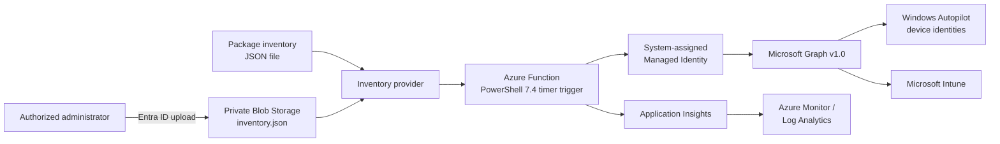

<div align="center">

# 🚀 Autopilot Device Configuration

### Secure, serverless Windows Autopilot naming and Group Tag automation

[](https://github.com/robgrame/Autopilot-Device-Configuration/actions/workflows/ci.yml)
[](VERSION)
[](https://learn.microsoft.com/azure/azure-functions/functions-reference-powershell)
[](https://learn.microsoft.com/azure/azure-functions/flex-consumption-plan)
[](https://learn.microsoft.com/graph/)
[](LICENSE)

**Correlate approved inventory records with Windows Autopilot devices by exact serial number, validate eligibility, and safely apply Device Name and Group Tag changes through Microsoft Graph.**

[Documentation](docs/README.md) ·
[Architecture](#architecture) ·
[Deployment](#deployment) ·
[Configuration](#configuration) ·
[Testing](#testing) ·
[Operations](#operations)

</div>

---

## ✨ Overview

This repository provides a secure-by-default Proof of Concept and MVP for replacing manual Windows Autopilot naming and Group Tag operations with an auditable Azure-hosted workflow.

> [!TIP]
> The complete project documentation is available in the
> **[documentation portal](docs/README.md)**, including deployment, security,
> configuration, operations, troubleshooting, governance, and the editable
> customer email template.

### Key capabilities

- ⏱️ **Scheduled automation** — one timer-triggered Azure Function with no public HTTP endpoint.
- 🔐 **Credential-free access** — system-assigned Managed Identity and least-privilege Microsoft Graph permissions.
- 🛡️ **Safe rollout controls** — `DRY_RUN=true`, pilot serial allow-list, exact matching, and fail-closed eligibility.
- ♻️ **Idempotent processing** — compliant devices are detected without unnecessary Graph updates.
- 📊 **Operational visibility** — structured Application Insights logs, correlation IDs, and execution summaries.
- 🧩 **Replaceable inventory source** — packaged JSON for bootstrap or private Blob ingestion for routine updates.
- 🧪 **Tenant-independent tests** — Microsoft Graph calls are mocked with Pester.
- 🏗️ **Repeatable infrastructure** — Azure Developer CLI and modular Bicep.

## 🧰 Technology stack

| Technology | Version / service | Role in the solution |
|:-----------|:------------------|:---------------------|
|  **Azure Functions** | Flex Consumption `FC1` | Serverless timer-triggered execution with scale-to-zero. |
|  **PowerShell** | `7.4` | Modular application logic, validation, retry handling, and administration scripts. |
|  **Microsoft Graph** | REST `v1.0` | Reads and updates Windows Autopilot device identities. |
|  **Azure Blob Storage** | Private container | Optional inventory ingestion without redeploying the Function package. |
| ☁️ **Windows Autopilot / Intune** | Microsoft Intune | Target platform for Device Name and Group Tag assignment. |
| 🪪 **Managed Identity** | System-assigned | Acquires Graph tokens without stored credentials or certificates. |
| 🏗️ **Bicep + AZD** | Infrastructure as Code | Provisions and packages the complete Azure solution. |
| 📈 **Application Insights** | Workspace-based | Structured telemetry, failures, audit events, and execution summaries. |
| 🧪 **Pester** | `5.5+` | Unit and behavior tests without a live Microsoft tenant. |
| ⚙️ **GitHub Actions** | CI | Runs Pester, PowerShell parsing, and Bicep compilation on every change. |

> [!IMPORTANT]
> The deployed solution starts in **dry-run mode**. Write mode cannot be enabled without an explicit pilot serial allow-list.

<a id="architecture"></a>

## 🏛️ Architecture review

### 1. Proposed architecture



The Function is stateless. A timer invocation loads and validates inventory, retrieves all Autopilot identities with pagination, correlates exact normalized serial numbers, evaluates eligibility, compares desired and current values, and either logs `WOULD_UPDATE` or calls the supported Graph action.

### 2. Azure resources

| Resource | Why it exists |
|----------|---------------|
| Azure Function App | Runs the single scheduled automation workload. |
| Flex Consumption plan (`FC1`) | Current recommended serverless plan for new Linux Functions; scales to zero and supports PowerShell 7.4. |
| Storage Account | Required by Azure Functions for host coordination and deployment; also hosts the optional private `inventory/inventory.json` Blob without adding another Azure resource. |
| Log Analytics workspace | Central Azure Monitor log store. |
| Application Insights | Function execution telemetry, structured logs, failures, and performance. |
| System-assigned Managed Identity | Acquires Microsoft Graph tokens without application credentials. |

No API Management, queueing service, database, Key Vault, public HTTP endpoint, VM, container, or Kubernetes resource is introduced.

### 3. Runtime choice

PowerShell 7.4 is selected because the customer requested PowerShell, it is a currently supported Azure Functions runtime, and it keeps the operational code accessible to Intune administrators.

The implementation uses direct REST instead of the Microsoft Graph PowerShell SDK:

- smaller deployment and faster cold starts;
- only two Graph operations are required;
- retry, pagination, timeout, and error behavior remain explicit;
- no interactive `Connect-MgGraph` dependency is introduced.

The trade-off is that request construction and error handling are maintained in this repository rather than delegated to the SDK.

### 4. Inventory ingestion options

The processing engine depends on `Get-DeviceInventoryRecords`, so the inventory source can change without modifying correlation, validation, eligibility, or Graph update logic.

| Option | Infrastructure impact | Security and operations | Recommendation |
|--------|-----------------------|-------------------------|----------------|
| `package-json` | No additional resources | Simplest bootstrap, but inventory changes require a new code deployment. | Keep for local development and the first controlled demonstration. |
| `storage-blob` | Reuses the existing Function Storage Account and private `inventory` container | Administrators upload JSON through Microsoft Entra RBAC; the Function reads it with Managed Identity. No keys, SAS tokens, or public API. | **Recommended MVP ingestion path.** |
| HTTP Function | Adds an HTTP trigger, authentication/authorization, request validation, concurrency control, audit requirements, and a public or private ingress decision | Easier system-to-system push, but materially increases the attack surface and operational complexity. | Defer until a CMDB or integration platform genuinely requires REST push ingestion. |

The Blob provider uses the Azure Storage REST API with a token for `https://storage.azure.com/`. Shared Key access remains disabled. The configured Blob URL must use HTTPS and cannot contain a SAS token or query string.

Official references:

- [Get Blob](https://learn.microsoft.com/rest/api/storageservices/get-blob)
- [Authorize Blob access with Microsoft Entra ID](https://learn.microsoft.com/azure/storage/blobs/authorize-access-azure-active-directory)

### 5. Microsoft Graph operations

| Operation | Request |
|-----------|---------|
| Enumerate Autopilot identities | `GET /v1.0/deviceManagement/windowsAutopilotDeviceIdentities` |
| Update an identity | `POST /v1.0/deviceManagement/windowsAutopilotDeviceIdentities/{id}/updateDeviceProperties` |

The list request selects `id`, `serialNumber`, `displayName`, `groupTag`, `enrollmentState`, `managedDeviceId`, and `azureActiveDirectoryDeviceId`. Pagination follows `@odata.nextLink` until exhausted.

The update body sends the desired Device Name and Group Tag and echoes the current user-assignment fields so the action cannot accidentally discard them:

```json
{
  "displayName": "IT-LT-00123",
  "groupTag": "NATIVE-IT-LAPTOP",
  "userPrincipalName": "current.user@example.invalid",
  "addressableUserName": "Current User"
}
```

The supported action returns `204 No Content`. The implementation uses `v1.0`; no beta dependency is required.

Official references:

- [List windowsAutopilotDeviceIdentities](https://learn.microsoft.com/graph/api/intune-enrollment-windowsautopilotdeviceidentity-list?view=graph-rest-1.0)
- [windowsAutopilotDeviceIdentity resource](https://learn.microsoft.com/graph/api/resources/intune-enrollment-windowsautopilotdeviceidentity?view=graph-rest-1.0)
- [updateDeviceProperties action](https://learn.microsoft.com/graph/api/intune-enrollment-windowsautopilotdeviceidentity-updatedeviceproperties?view=graph-rest-1.0)

### 6. Exact Microsoft Graph permission

`DeviceManagementServiceConfig.ReadWrite.All` is the only Microsoft Graph application permission assigned.

It is required because:

- listing supports `DeviceManagementServiceConfig.Read.All` or `DeviceManagementServiceConfig.ReadWrite.All`;
- updating requires `DeviceManagementServiceConfig.ReadWrite.All`;
- assigning only the read/write permission satisfies both operations without adding another broader permission.

### 7. Managed Identity authorization

Bicep enables a system-assigned Managed Identity on the Function App. Azure resource deployment creates the identity, but ARM/Bicep does not safely grant Microsoft Graph tenant app roles.

After deployment, a **Privileged Role Administrator** runs:

```powershell
.\scripts\Grant-GraphPermission.ps1 `
  -ResourceGroupName '<resource-group>' `
  -FunctionAppName '<function-app>'
```

The script:

1. reads the Function Managed Identity principal ID;
2. resolves the Microsoft Graph service principal;
3. resolves the app role by value, not a hard-coded app-role GUID;
4. checks existing app-role assignments;
5. creates the assignment only when absent;
6. verifies the resulting assignment.

Microsoft documents that Privileged Role Administrator is required to grant Microsoft Graph application permissions. Cloud Application Administrator and Application Administrator cannot grant Microsoft Graph app roles.

Reference: [Grant tenant-wide admin consent to an application](https://learn.microsoft.com/entra/identity/enterprise-apps/grant-admin-consent).

### 8. Processing flow

1. Generate a correlation ID.
2. Load and validate configuration.
3. Load inventory through the configured provider.
4. Detect duplicate inventory serials and desired names.
5. Retrieve every Autopilot identity and follow pagination.
6. Normalize serials by trimming and converting to uppercase.
7. Reject empty serials and use exact normalized matching only.
8. Apply field validation and eligibility rules.
9. Reject missing, duplicate, ambiguous, excluded, legacy, Hybrid, or conflicting records.
10. Compare the desired Device Name and Group Tag with current values.
11. Log `COMPLIANT` when neither property differs.
12. Log `WOULD_UPDATE` when a change is required in dry-run mode.
13. Call `updateDeviceProperties` only for validated, eligible pilot devices in write mode.
14. Continue after device-level failures.
15. Emit an execution summary.

### 9. Eligibility model

An inventory record is eligible only when all of these conditions are true:

- `EligibleForAutomation` is explicitly `true`;
- serial, Device Name, and Group Tag are valid and unique;
- the Autopilot serial match is unique;
- `Legacy`, `Excluded`, and `ConflictingProvisioningInfo` are not `true`;
- `ProvisioningMethod` is `Autopilot` or `CloudNative`;
- `LifecycleState` is `Approved`, `Pilot`, or `Ready`;
- `JoinType` is `MicrosoftEntraJoined` or `Pending`;
- when a pilot list is configured, the serial is present in that list.

Missing provisioning, lifecycle, or join-type data is ambiguous and therefore fails closed.

The Autopilot identity alone does not reliably expose the current Microsoft Entra join type. A production provider should resolve `managedDeviceId` and `azureActiveDirectoryDeviceId` against Intune managed-device and Entra device records. The MVP does not infer safety when this evidence is absent; it requires explicit approved inventory metadata.

### 10. Security controls

- No secrets, certificates, passwords, or stored access tokens.
- System-assigned Managed Identity token acquisition.
- Least-privilege Graph app role.
- Storage shared-key authentication disabled.
- Blob public access disabled.
- TLS 1.2 minimum and FTPS disabled.
- Application Insights local authentication disabled.
- No HTTP trigger or externally exposed custom endpoint.
- Dry-run default and mandatory pilot list before write mode.
- Exact serial matching and duplicate rejection.
- Sanitized structured logs.
- Application Insights trace sampling disabled so write-audit events are retained.
- Bounded retries with exponential backoff, jitter, `Retry-After`, and timeouts.
- Authorization and configuration failures stop the batch; device failures do not.

### 11. Assumptions

- The tenant has active Microsoft Intune licensing and Windows Autopilot.
- Devices are already registered in Autopilot.
- The inventory owner can assert provisioning method, lifecycle state, and join type for the pilot.
- Device names use the Windows Autopilot rules documented for naming templates: 15 characters or fewer, letters/numbers/hyphens, and not all numeric.
- The organizational Device Name and Group Tag patterns are approved before write mode.

### 12. Known limitations

- Inventory is deployment-package JSON, not a live enterprise source.
- No direct managed-device or Entra device join-state lookup is included.
- Rollback data is retained in structured logs, not a dedicated immutable change store.
- The MVP uses public Azure service endpoints with authentication and secure defaults; private endpoints are a production evolution.
- Group Tag changes can change dynamic Microsoft Entra group membership and downstream Intune assignments.
- Updating the Autopilot display name does not immediately rename an already enrolled Windows device; the name is applied during a later supported enrollment/OOBE flow. Group Tag changes can affect dynamic membership sooner.
- Function executions on Flex Consumption can be interrupted by platform events; the idempotent design makes reruns safe.
- Very large Autopilot tenants may exceed the ten-minute MVP execution window despite `$top=100`; production should add resumable orchestration only when measurements justify it.

### 13. Production evolution

- Replace the packaged provider with a CMDB or internal API.
- Resolve managed-device and Entra join-state data before eligibility.
- Add approval workflow and immutable change history.
- Add private endpoints and controlled egress.
- Add dashboards, alerts, deployment environments, and policy-as-code.
- Add dead-letter or durable orchestration only if batch size and reliability requirements justify the extra resources.

## 📁 Repository structure

```text
.
|-- .azure/deployment-plan.md
|-- .github/workflows/ci.yml
|-- docs/
|   |-- README.md
|   |-- architecture.md
|   |-- deployment-guide.md
|   |-- operations-runbook.md
|   `-- email/
|-- infra/
|   |-- main.bicep
|   |-- main.parameters.json
|   `-- modules/
|-- scripts/
|-- src/
|   |-- inventory/
|   |-- Modules/
|   `-- timerFunction/
|-- tests/
|-- azure.yaml
|-- README.md
`-- VERSION
```

## ✅ Prerequisites

### Azure and Intune

- An Azure subscription approved for the customer workload.
- Contributor on the deployment resource group or subscription.
- User Access Administrator or Owner when assigning Azure RBAC through deployment.
- An active Microsoft Intune license.
- Windows Autopilot registered devices.
- A controlled test device for the pilot.

### Microsoft Entra

- Privileged Role Administrator to assign `DeviceManagementServiceConfig.ReadWrite.All` to the Managed Identity.
- Review and approval of dynamic groups and Intune assignments that depend on Group Tag.

### Local tools

- PowerShell 7.4 or later.
- Azure CLI.
- Azure Developer CLI (`azd`).
- Azure Functions Core Tools v4 for optional local host execution.
- Pester 5.5 or later.

<a id="deployment"></a>

## 🚀 Deployment

### 1. Clone

```powershell
git clone https://github.com/robgrame/Autopilot-Device-Configuration.git
Set-Location .\Autopilot-Device-Configuration
```

### 2. Review safety inputs

Before deployment:

- replace fictitious inventory with controlled pilot data;
- verify naming and Group Tag conventions;
- verify eligibility metadata;
- identify every dynamic group using `[OrderID]` / Group Tag;
- review downstream Intune applications, profiles, scripts, and policies;
- keep `DRY_RUN=true`;
- set `PILOT_SERIAL_NUMBERS` to the approved test serials.

### 3. Deploy infrastructure and code

```powershell
.\scripts\Deploy.ps1 `
  -EnvironmentName 'pilot' `
  -SubscriptionId '<customer-subscription-id>' `
  -Location 'westeurope'
```

The script uses two phases:

1. `azd provision --no-prompt`;
2. wait for RBAC propagation;
3. `azd deploy --no-prompt`;
4. verify `DRY_RUN=true`.

### 4. Assign the Microsoft Graph app role

Run as Privileged Role Administrator:

```powershell
.\scripts\Grant-GraphPermission.ps1 `
  -ResourceGroupName 'rg-autopilot-pilot' `
  -FunctionAppName '<function-app-name>'
```

This step cannot be completed by ordinary Azure resource deployment because it changes a Microsoft Graph app-role assignment in the tenant.

### 5. Verify role assignment

The permission script performs verification automatically. It is safe to rerun.

### 6. Publish inventory to private Blob Storage

An administrator with **Storage Blob Data Contributor** on the Storage Account and permission to update the Function App configuration can validate, upload, and activate the external inventory provider:

```powershell
.\scripts\Publish-Inventory.ps1 `
  -SubscriptionId '<customer-subscription-id>' `
  -ResourceGroupName '<resource-group>' `
  -FunctionAppName '<function-app>' `
  -StorageAccountName '<storage-account>' `
  -InventoryPath '.\inventory.json'
```

The script uses Microsoft Entra authentication (`--auth-mode login`), uploads to `inventory/inventory.json`, and switches `INVENTORY_PROVIDER` to `storage-blob`. When run from the repository with an AZD environment selected, it also persists that choice so later provisioning does not revert it; otherwise it warns and prints the required `azd env set` command. It never creates or stores an account key or SAS token.

### 7. Test the Function

Wait for the timer or run the timer function from the Azure portal. Confirm:

- the start log says `DryRun: true`;
- only approved pilot serials are eligible;
- changes are logged as `WOULD_UPDATE`;
- no `DeviceUpdated` event exists;
- the Intune Autopilot values remain unchanged.

<a id="configuration"></a>

## ⚙️ Configuration

| Setting | Default | Purpose |
|---------|---------|---------|
| `DRY_RUN` | `true` | Prevents Graph updates and logs `WOULD_UPDATE`. |
| `TIMER_SCHEDULE` | `0 0 */6 * * *` | NCRONTAB schedule; every six hours. |
| `INVENTORY_PROVIDER` | `package-json` | Selects `package-json` or `storage-blob`. |
| `INVENTORY_PATH` | `inventory/sample-inventory.json` | Path inside the Function package. |
| `INVENTORY_STORAGE_BLOB_URL` | Provisioned private Blob URL | Public-Azure HTTPS Blob URL used by `storage-blob`; query strings and SAS tokens are rejected. |
| `DEVICE_NAME_VALIDATION_PATTERN` | `^[A-Za-z][A-Za-z0-9-]{0,14}$` | Organizational Device Name rule. |
| `GROUP_TAG_VALIDATION_PATTERN` | `^[A-Za-z0-9][A-Za-z0-9._-]{0,63}$` | Organizational Group Tag rule. |
| `PILOT_SERIAL_NUMBERS` | Empty in Azure; `SERIAL001` in the local example | Comma-separated serial allow-list. Required for write mode. |
| `LOG_LEVEL` | `Information` | Operational log verbosity. |
| `GRAPH_API_VERSION` | `v1.0` | Microsoft Graph API version. |
| `MAX_RETRY_COUNT` | `4` | Maximum retries after the initial Graph request. |
| `RETRY_BASE_DELAY_SECONDS` | `2` | Base delay for exponential backoff. |
| `GRAPH_REQUEST_TIMEOUT_SECONDS` | `100` | Timeout for each Graph request. |

Configuration is validated before device processing. Invalid Boolean, integer, provider, API-version, or write-mode pilot settings cause a configuration error.

## 📋 Inventory format

Minimum business fields:

```json
{
  "SerialNumber": "SERIAL001",
  "DeviceName": "IT-LT-00123",
  "GroupTag": "NATIVE-IT-LAPTOP",
  "EligibleForAutomation": true
}
```

The conservative MVP also requires:

```json
{
  "ProvisioningMethod": "Autopilot",
  "LifecycleState": "Pilot",
  "JoinType": "MicrosoftEntraJoined",
  "Legacy": false,
  "Excluded": false,
  "ConflictingProvisioningInfo": false
}
```

Validation rules:

- serials are trimmed and compared case-insensitively;
- empty and partial serial matches are rejected;
- duplicate normalized serials are rejected;
- duplicate desired Device Names are rejected;
- Device Names are not truncated or rewritten;
- Group Tags are not truncated or rewritten;
- missing risk metadata fails closed.

All committed sample values are fictitious.

### Updating inventory without redeployment

After Blob ingestion is enabled, publish a revised JSON file with the same command:

```powershell
.\scripts\Publish-Inventory.ps1 `
  -SubscriptionId '<customer-subscription-id>' `
  -ResourceGroupName '<resource-group>' `
  -FunctionAppName '<function-app>' `
  -StorageAccountName '<storage-account>' `
  -InventoryPath '.\inventory.json'
```

The next timer execution reads the new Blob content. Administrators upload through their own Microsoft Entra identities and Azure RBAC. The MVP reuses the Function host Storage Account, so its Managed Identity also has the broader Blob permissions required by the Functions runtime; inventory integrity therefore also depends on controlling changes to that identity and Storage Account.

## 🧪 Dry-run validation

1. Add a fictitious-style inventory record using the serial of one controlled Autopilot test device.
2. Set `EligibleForAutomation=true` and explicit approved eligibility metadata.
3. Add that serial to `PILOT_SERIAL_NUMBERS`.
4. Confirm `DRY_RUN=true`.
5. Execute the Function.
6. Query Application Insights for `DeviceWouldUpdate`.
7. Verify current and desired values in the structured event.
8. Confirm the Autopilot record was not modified.

Example Log Analytics query:

```kusto
traces
| where timestamp > ago(24h)
| where message has '"EventName":"DeviceWouldUpdate"'
| order by timestamp desc
```

## ✍️ Enabling write mode

Write mode is an explicit configuration change:

```powershell
.\scripts\Set-DryRun.ps1 `
  -ResourceGroupName '<resource-group>' `
  -FunctionAppName '<function-app>' `
  -DryRun $false `
  -PilotSerialNumbers 'SERIAL001'
```

Before enabling it, verify:

- inventory accuracy;
- Device Name convention;
- Group Tag convention;
- eligibility and Hybrid-device exclusions;
- dynamic Microsoft Entra group behavior;
- downstream Intune assignments;
- Managed Identity Graph permission;
- dry-run results for each pilot serial.

Keep the first write pilot as small as possible. Expand the allow-list only after the resulting group membership and Intune targeting are verified.

<a id="testing"></a>

## 🔬 Testing

Tests never contact Microsoft Graph.

```powershell
Install-Module Pester -MinimumVersion 5.5.0 -Scope CurrentUser -Force
.\scripts\Invoke-Tests.ps1
```

The suite covers exact and normalized matching, missing devices, duplicates, validators, eligibility, Hybrid exclusion, compliance, partial and full updates, dry-run, Graph throttling/transient/permanent failures, per-device failure isolation, and idempotency.

<a id="operations"></a>

## 📊 Operations

### Schedule

The default is every six hours. Change `TIMER_SCHEDULE` only after considering batch duration and Graph throttling.

### Structured events

Important events include:

- `ExecutionStarted`
- `DeviceValidationFailed`
- `DeviceEligibilityFailed`
- `DeviceCorrelationFailed`
- `DeviceCompliant`
- `DeviceWouldUpdate`
- `DeviceUpdated`
- `DeviceUpdateFailed`
- `ExecutionSummary`
- `ExecutionFailed`

### Execution summaries

```kusto
traces
| where timestamp > ago(7d)
| where message has '"EventName":"ExecutionSummary"'
| extend payload = parse_json(message)
| project timestamp,
          CorrelationId=tostring(payload.CorrelationId),
          DryRun=tobool(payload.DryRun),
          Inventory=todouble(payload.InventoryRecordsLoaded),
          Matches=todouble(payload.UniqueMatches),
          Proposed=todouble(payload.ProposedUpdates),
          Updated=todouble(payload.SuccessfulUpdates),
          Failed=todouble(payload.FailedUpdates)
| order by timestamp desc
```

### Failure investigation

- `401`: Managed Identity token or tenant context problem.
- `403`: Graph app role missing or not propagated.
- `404`: stale Autopilot identity or incorrect resource ID.
- `429`: throttling; the client honors `Retry-After`.
- `5xx` or network errors: bounded exponential backoff with jitter.
- validation, eligibility, and correlation errors: affected device is skipped.

Tokens, authorization headers, credentials, secrets, and full Graph response bodies are not logged.

## ↩️ Rollback

The automation changes only:

- Autopilot `displayName`;
- Autopilot `groupTag`.

Before each write, `DeviceUpdated` logs the previous and desired values. To roll back:

1. Return to dry-run mode:

   ```powershell
   .\scripts\Set-DryRun.ps1 `
     -ResourceGroupName '<resource-group>' `
     -FunctionAppName '<function-app>' `
     -DryRun $true
   ```

2. Disable the timer if required:

   ```powershell
   .\scripts\Set-TimerState.ps1 `
     -ResourceGroupName '<resource-group>' `
     -FunctionAppName '<function-app>' `
     -Enabled $false
   ```

3. Query `DeviceUpdated` events by correlation ID.
4. Restore the previous Device Name and Group Tag manually or through a controlled rollback inventory.
5. Verify dynamic group membership and downstream Intune assignments.

## 🛣️ Production evolution

Production improvements should be introduced only when justified:

- enterprise CMDB or API provider;
- managed-device and Entra join-state lookups;
- private endpoints and network isolation;
- durable change history;
- approval workflow;
- dead-letter handling;
- centralized multi-country inventory;
- deployment promotion pipelines;
- stronger Azure Policy controls;
- dashboards and alerting.

## 📄 License

MIT. See [LICENSE](LICENSE).
