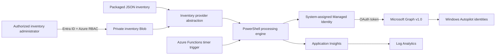
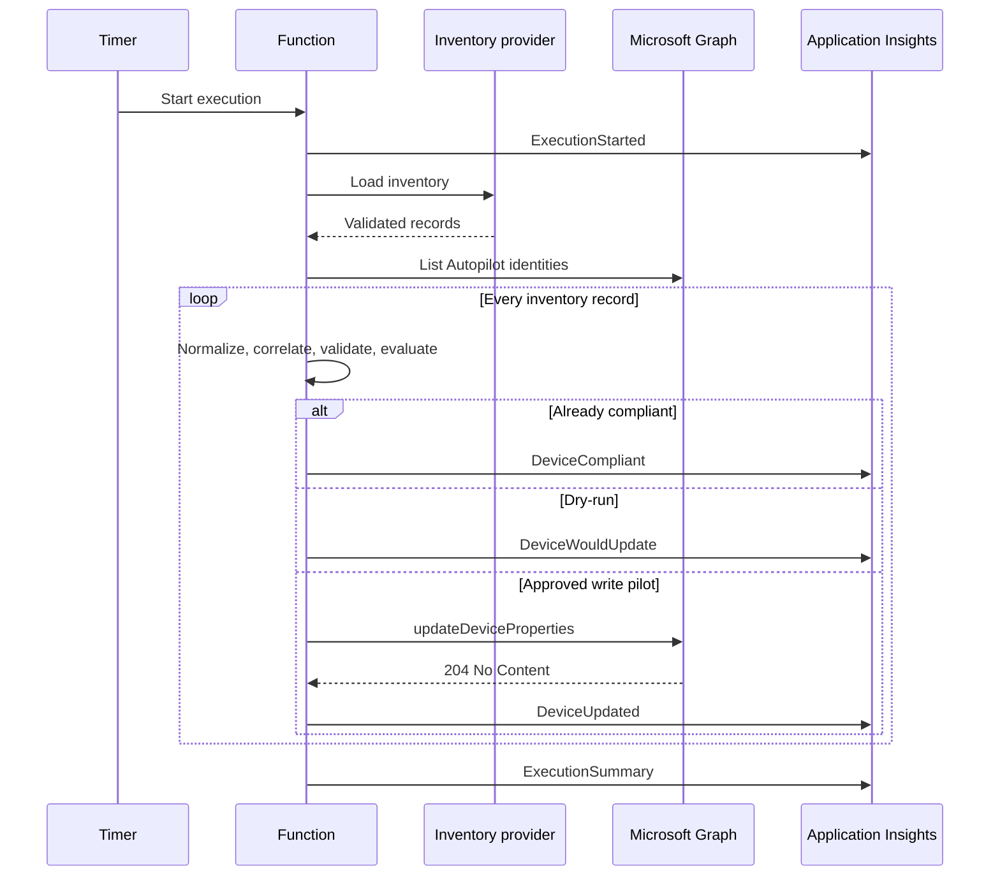

# Architecture

## Logical architecture



## Azure resource topology

| Resource | Configuration | Purpose |
|----------|---------------|---------|
| Resource group | One per AZD environment | Lifecycle and access boundary. |
| Function App | Linux, Functions v4, PowerShell 7.4 | Hosts the timer-triggered worker. |
| Flex Consumption plan | `FC1`, 2 GB instance | Serverless execution with scale-to-zero. |
| Storage Account | Standard LRS, TLS 1.2, Shared Key disabled | Function host/deployment storage and optional inventory Blob. |
| Blob containers | `app-package`, `inventory` | Function package and private `inventory.json`. |
| Application Insights | Workspace-based, local auth disabled | Structured application telemetry. |
| Log Analytics | 30-day retention | Central query and diagnostic store. |
| Managed Identity | System-assigned | Authenticates to Storage and Microsoft Graph. |

The MVP intentionally does not add API Management, Key Vault, a database,
queueing middleware, virtual machines, containers, or Kubernetes.

## Runtime components

| Module | Responsibility |
|--------|----------------|
| `Configuration.psm1` | Loads defaults and rejects invalid runtime settings. |
| `InventoryProvider.psm1` | Reads package or Blob inventory and validates JSON size/shape. |
| `GraphClient.psm1` | Acquires Managed Identity tokens, paginates Graph, retries, and updates devices. |
| `Validation.psm1` | Normalizes serials and validates names, tags, and inventory consistency. |
| `Eligibility.psm1` | Applies provisioning, lifecycle, join, exclusion, and pilot controls. |
| `Processor.psm1` | Correlates records, isolates device failures, updates Graph, and produces summaries. |
| `Logging.psm1` | Emits structured events with correlation IDs. |
| `timerFunction/run.ps1` | Orchestrates one timer execution. |

## Data flow

### Inventory

The processing engine calls one provider interface:

```powershell
Get-DeviceInventoryRecords -Configuration $configuration
```

Supported providers:

- `package-json`: local file inside the deployed Function package;
- `storage-blob`: private HTTPS Blob read with a Managed Identity token for
  `https://storage.azure.com/`.

The Blob URL validator requires public Azure HTTPS, at least a container and
Blob path, and no query string or SAS token.

### Microsoft Graph

The Function uses two Graph operations:

```text
GET  /v1.0/deviceManagement/windowsAutopilotDeviceIdentities
POST /v1.0/deviceManagement/windowsAutopilotDeviceIdentities/{id}/updateDeviceProperties
```

The list operation follows every `@odata.nextLink`. The update body includes
the desired `displayName` and `groupTag` and preserves the current
`userPrincipalName` and `addressableUserName`.

## Processing sequence



## Availability and scalability

- The worker is stateless and idempotent.
- Flex Consumption executions can be interrupted; rerunning is safe.
- Graph and Blob transient failures use bounded exponential backoff.
- Device-level Graph failures do not terminate unrelated device processing.
- Batch-wide configuration, authentication, or authorization failures stop the run.
- The current ten-minute Function timeout is suitable for the MVP and controlled
  tenant size; large tenants may require measurement and later orchestration.

## Technical decisions

| Decision | Rationale | Trade-off |
|----------|-----------|-----------|
| PowerShell 7.4 | Matches customer operations skills and Functions support. | Less compile-time type safety than .NET. |
| Direct Graph REST | Small package, explicit pagination and retry behavior. | Request maintenance remains in the repository. |
| Timer trigger only | Small attack surface and predictable batch operation. | No on-demand API integration. |
| Managed Identity | No stored application credentials. | Graph app-role assignment requires a privileged post-deployment step. |
| Reuse Function Storage | No additional Blob resource or cost for inventory. | Function identity has broader Blob rights required by the host runtime. |
| Fail-closed eligibility | Prioritizes safety over maximum automation coverage. | Incomplete inventory records require remediation before processing. |

## Future architecture

- Resolve Intune managed-device and Entra device state directly.
- Add a governed CMDB or internal API provider.
- Add immutable approval and change-history storage.
- Add private endpoints, VNet integration, and controlled outbound traffic.
- Add deployment environments, Azure Policy, alerts, and dashboards.
- Introduce durable orchestration only if measured tenant scale requires it.

