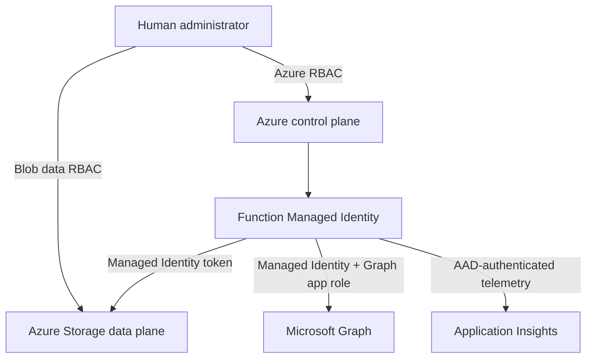

# Security and Permissions

## Security objectives

- Eliminate stored credentials and account keys.
- Minimize externally reachable interfaces.
- Restrict updates to approved records and pilot devices.
- Fail closed when identity, configuration, or inventory evidence is incomplete.
- Preserve enough telemetry for operational audit without logging sensitive tokens.
- Separate Azure deployment, Graph authorization, inventory publication, and
  write-mode approval duties.

## Trust boundaries



## Identity model

### Runtime identity

The Function App uses a system-assigned Managed Identity. It acquires tokens
from the Azure Functions identity endpoint at runtime. Tokens are cached only
in process and are never persisted.

### Administrator identities

Administrators authenticate interactively with Microsoft Entra ID:

- Azure CLI and AZD for resource deployment;
- Azure CLI `--auth-mode login` for inventory upload;
- a Privileged Role Administrator session for Graph app-role assignment.

## Required permissions

| Actor | Permission | Scope | Purpose |
|-------|------------|-------|---------|
| Deployment operator | Contributor | Subscription or target resource group | Provision and configure resources. |
| Deployment operator | Owner or User Access Administrator | Target deployment scope | Create Azure RBAC assignments. |
| Graph authorization operator | Privileged Role Administrator | Microsoft Entra tenant | Assign the Graph application role to the Managed Identity. |
| Inventory publisher | Storage Blob Data Contributor | Storage Account or inventory container | Create/update `inventory/inventory.json`. |
| Inventory publisher | Permission to update Function App settings | Function App | Activate the Blob provider. |
| Function Managed Identity | `DeviceManagementServiceConfig.ReadWrite.All` | Microsoft Graph application permission | List and update Autopilot identities. |
| Function Managed Identity | Storage Blob Data Owner | Function Storage Account | Required by the Function host/deployment design and Blob access. |
| Function Managed Identity | Storage Queue Data Contributor | Function Storage Account | Function host coordination. |
| Function Managed Identity | Monitoring Metrics Publisher | Application Insights | AAD-authenticated telemetry. |

## Microsoft Graph authorization

Only this application permission is required:

```text
DeviceManagementServiceConfig.ReadWrite.All
```

It covers both listing and updating Windows Autopilot device identities. The
permission is not embedded in Bicep. After deployment, run:

```powershell
.\scripts\Grant-GraphPermission.ps1 `
  -ResourceGroupName '<resource-group>' `
  -FunctionAppName '<function-app>'
```

The script resolves the Microsoft Graph service principal and app role by
value, detects an existing assignment, creates it only when absent, and verifies
the result.

## Preventive controls

- No client secret, certificate, password, Storage Account key, or SAS token.
- No custom HTTP trigger.
- Storage public Blob access disabled.
- Storage Shared Key authorization disabled.
- TLS 1.2 minimum.
- FTPS disabled.
- Application Insights local authentication disabled.
- Blob URL must use HTTPS and cannot include a query string.
- `DRY_RUN=true` by default.
- Write mode requires a non-empty pilot serial allow-list.
- Exact normalized serial matching only.
- Duplicate inventory serials and desired names are rejected.
- Missing lifecycle, provisioning, or join metadata fails closed.
- Legacy, excluded, Hybrid, and conflicting records are rejected.
- Device Name and Group Tag values are validated, never silently rewritten.
- Authorization and configuration failures stop the batch.

## Detective controls

- Every execution has a correlation ID.
- Structured events record validation, eligibility, matching, proposed changes,
  successful changes, and failures.
- Execution summaries provide aggregate counts and duration.
- Dry-run uses `DeviceWouldUpdate`, while write mode uses `DeviceUpdated`.
- Full authorization headers, access tokens, and Graph response bodies are not logged.
- GitHub Actions validates tests, PowerShell syntax, and Bicep compilation.

## Inventory integrity

The Blob inventory is private and uploaded through Entra authentication. The
MVP reuses the Function host Storage Account; because the Function runtime
requires broad Blob rights, its Managed Identity can also modify inventory.

Mitigations:

- tightly control changes to the Function App and its identity;
- tightly control Storage Account data-plane role assignments;
- restrict inventory publication to named administrators;
- monitor Blob modifications and Function configuration changes;
- retain approved inventory versions outside the runtime account;
- use a separate read-only inventory account in a future hardened design.

## Logging and privacy

Logs may include serial numbers, current and desired Device Names, Group Tags,
reason codes, and correlation identifiers. Treat the telemetry workspace as
operational device data:

- restrict Log Analytics and Application Insights access;
- apply the customer retention policy;
- do not add user secrets or unrestricted Graph payloads to logs;
- export or delete data according to customer governance requirements.

## Residual risks

| Risk | Current mitigation | Future option |
|------|--------------------|---------------|
| Incorrect approved inventory | Dry-run, pilot list, validation, named inventory owner | Approval workflow and signed/versioned inventory. |
| Group Tag changes alter targeting | Pilot and pre-change dependency review | Automated dynamic-group impact analysis. |
| Broad Function Storage rights | Administrative controls and monitoring | Separate inventory Storage Account with Blob Data Reader. |
| Public Azure service endpoints | Authentication, TLS, no public Blob access | Private endpoints and controlled egress. |
| Missing live join-state verification | Explicit inventory metadata and fail-closed eligibility | Query Intune managed devices and Entra devices. |
| Privileged Graph permission | Single documented app role and audit logs | Periodic access review and workload identity governance. |

## Security review checklist

- [ ] Confirm deployment tenant and subscription.
- [ ] Review all Azure role assignments.
- [ ] Confirm Shared Key access is disabled.
- [ ] Confirm Blob public access is disabled.
- [ ] Confirm there is no HTTP-triggered Function.
- [ ] Confirm only `DeviceManagementServiceConfig.ReadWrite.All` is assigned.
- [ ] Confirm `DRY_RUN=true` before the pilot.
- [ ] Review `PILOT_SERIAL_NUMBERS`.
- [ ] Review Group Tag-based dynamic groups and downstream Intune assignments.
- [ ] Confirm telemetry access and retention.
- [ ] Confirm inventory publication ownership and change control.

